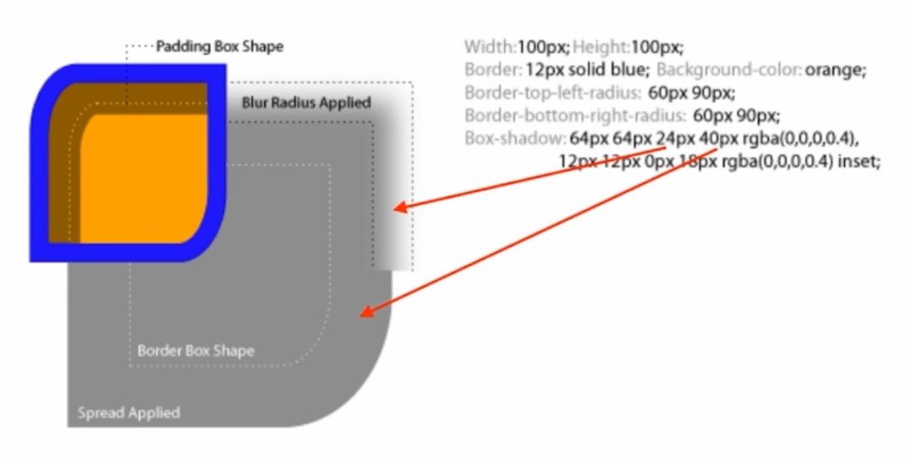
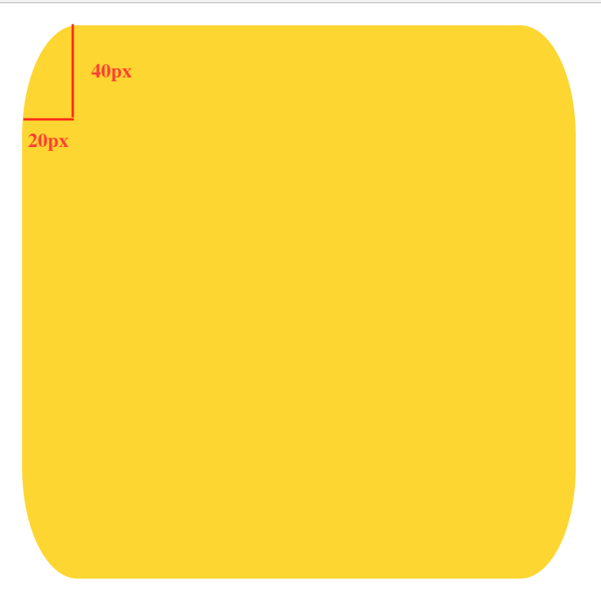

## 目录


## HTML 相关

### 1. HTML 常见元素

不赘述了。

### 2. 版本

HTML 是基于 SGML 的一个应用，不断迭代；SGML 是一个通用的标记语言，XML 是 SGML 的超集。

XHTML 属于 XML，是对 HTML 进行 XML 严格化的产物；

HTML5 不属于 SGML 或 XML，是基于 HTML4 的升级，在书写要求上会比 XHTML 宽松些。

它们的一些约束内容如下：

|        HTML4         |        XHTML         |        HTML5         |
| :------------------: | :------------------: | :------------------: |
|    标签允许不结束    |     标签必须结束     |     标签允许结束     |
|    属性不用带引号    |    属性必须带引号    |    属性不用带引号    |
|    标签属性可大写    |   标签属性必须小写   |    标签属性可大写    |
| Boolean 属性可省略值 | Boolean 属性必须写值 | Boolean 属性可省略值 |

### 3. 元素分类

- 按默认样式分类
    - 块级 block
    - 行内 inline（ 内联元素 ）
    - 行内块级 inline-block
- 按内容分

    [https://www.w3.org/TR/html5/dom.html#kinds-of-content](https://www.w3.org/TR/html5/dom.html#kinds-of-content)

### 4. 嵌套关系

- 「块级元素」**可以包含**「行内元素」
- 「块级元素」**不一定包含**「块级元素」如：`<p>` 不能包含「块级元素」
- 「行内元素」**一般不能包含**「块级元素」如：`<a>` 元素可以包含「块级元素」

### 5. 默认样式

最小的 Reset：

```css
* {
    margin: 0;
}
```

推荐：[**Normalize.css**](https://necolas.github.io/normalize.css/)

---

### HTML 面试题

#### 1. <!DOCTYPE html> 的意义是什么？

历史原因：IE 有一些自己的渲染模型，加上 `DOCTYPE` 会让 IE 以标准模型渲染。

这样做的好处是：可以让浏览器以标准模式进行渲染，并且让浏览器知道元素的合法性。

#### 2. HTML、XHTML、HTML5 之间有什么关系？

HTML 是基于 SGML 的一个应用；SGML 是一个通用的标记语言，XML 是 SGML 的超集。

XHTML 属于 XML，是 HTML 进行 XML 严格化的产物；

HTML5 不属于 SGML 或 XML，是基于 HTML4 的升级，在书写要求上会比 XHTML 宽松些。

#### 3. HTML5 有什么变化？

- 新的语义化元素，如 `<nav>`、`<section>`、`<article>`、`<footer>` 等。
- 表单增强，如：表单验证，新的类型 `range`、`number` 等，详见 [HTML5 Input 类型](http://www.w3school.com.cn/html5/html_5_form_input_types.asp)
- 新的 API，这是最大的变化，如：application-cache、音频视频标签、图形 Canvas 或 SVG、实时通讯 webscoket、本地存储 localstorage、本地存储 indexDB、增加获取定位、加速计、陀螺仪等设备信息的能力。

#### 4. em 和 i 有什么区别？

`em` 是语义化的标签，表「强调」；
在以前，`i` 是纯样式的标签，表「斜体」（ italic ），现在一般用于显示图标，表「icon」。

#### 5. 语义化的意义是什么

首先，HTML 是一个文档，需要开发者容易阅读和理解，另一方面，机器（ 一些读屏软件、SEO ）也更容易理解页面结构。

#### 6. 那些元素可以自闭合？

`img`、`input`、`br`、`hr`、`meta`、`link`。

#### 7. HTML 和 DOM 的关系。

HTML 仅仅只是字符串，而 DOM 是由 HTML 解析而来的一个具有结构的「树」，通过 JavaScript 可以对 DOM 进行维护。

#### 8. property 和 attribute 有什么不同？

举个例子：`<input type="text" value="1" />`。

上面的 HTML 属性 `value` 就是一个 attribute，只能通过 `setAttribute` 进行更改，但是 property 是 `$0.value`，可以直接进行 get 和 set 并实时渲染。所以 attribute 是「死」的，property 是「活」的。

#### 9. form 的作用有哪些？

1. 用于直接提交表单。
2. 使用 `submit` 和 `reset` 按钮。
3. 便于大部分浏览器保存表单信息。
4. 第三方库可以整体取值。
5. 第三方库可以进行表单验证。

---

## CSS 基础

### 1. 选择器

1. 匹配 HTMl 元素（ 作用 ）
2. 分类和权重

    - ID 选择器 `#id`：+ 100
    - 类、属性、伪类选择器：+ 10
    - 元素、伪元素选择器：+ 1
    - 其他选择器：+ 0

    还需要记的一个是：不进位。（ 俗话说：官大一级压死人 ）

3. 解析方式和性能：选择器表达式从右往左解析，防止范围过大，加快解析速度、寻找元素，性能较好。
4. 值得关注的选择器
5. 伪类和伪元素：伪类表示的「状态」而不是某个「元素」，用**单冒号**表示，如 `:hover`；伪元素表示的「元素」（ 某个真实存在的元素 ），用**双冒号**表示，如 `::before`。

### 2. 非布局样式

**主要内容**：

- 字体、字重、颜色、大小、行高
- 背景、边框
- 滚动、换行
- 粗体、斜体、下划线

---

#### 1. 字体

- 字体族：会在这一类字体中寻找某个字体作为渲染字体。

    - 衬线字体：serif，在字的笔画开始、结束的地方有额外的装饰，而且笔画的粗细会有所不同。
    - 非衬线字体：sans serif，没有额外的装饰，而且笔画的粗细差不多。
    - 等宽字体：monospace，字符宽度相同的电脑字体。
    - 手写体：
    - 花体

    需要注意的是，在 `font-family` 中指定字体的时候，字体名称需要用「引号」包裹，字体族不需要，比如：`font-family: 'Microsoft Yahei', serif;`

- 多字体 fallback

    当指定字体无法找到，就往后继续寻找能够找到的字体。

- 网络、自定义字体

    ```css
    @font-face {
        font-family: 'name';
        src: url('字体地址，本地或者网络')
    }
    ```

    如果使用网络字体，需要注意跨域的问题。

- iconfont：详情 [Iconfont-阿里巴巴矢量图标库](http://www.iconfont.cn/)

#### 2. 行高

- 行高的构成

    `line-box` 表示一整行的盒子，里面可以有许多 `inline-box`。

    没有标签的内容是「匿名内联元素」。

    `line-height` 可以撑起 `line-box` 的高度，但是不会影响 `inline-box`（ 内联元素 ）布局的高度。

    行高是 `line-box` 的高度，是由 `inline-box` 的高度撑起的。

    `inline-box` 元素的 `background` 是根据字体的顶部和底部渲染的。

- 行高相关的现象和方案

    **例子**：一个 `line-box` 里面有一个 `<span>` 和一个 `` 元素，这时候在图片下方会有一小段的空白。

    **原因**：`` 是一个 `inline-box` 的元素，也需要遵守行高的规定，默认也需要按照 `baseline` 也就是**基线**进行对齐；这就意味着**基线**到**底线**还有一段距离，所以会照成空隙的产生；空隙的高度是由字体的大小决定的，一般来说 `12px` 的字体大小，图片底部就会有 `3px` 左右的空隙。这就是经典的「图片 3px 缝隙问题」。

    **解决方案**：第一种方法是对 `` 设置 `vertical-align: bottom`；第二种方法是设置 `` 的 `display` 属性，可以改为 `block`。

- 行高的调整

#### 3. 背景

- 背景颜色

    - 英文单词；
    - 十六进制及其简写：`#ff0000`、`#f00`；
    - `rgb` 以及 `rgba`：`rgb(red, green, blue)`、`rgba(red, green, blue, alpha)`；
    - `hsl` 以及 `hsla`：`hsl(色相 0-360, 饱和度 0%-100%, 亮度 0%-100%)`、`hsl(色相 0-360, 饱和度 0%-100%, 亮度 0%-100%, 透明度 0-1)`；

- 渐变色背景

    - `background: -webkit-linear-gradient(起始位置, 开始颜色, 结束颜色)`；

        如：`background: -webkit-linear-gradient(left, red, green)`

    - `background: linear-gradient(to 结束位置, 开始颜色, 结束颜色)`；

        如：`background: linear-gradient(to right, red, green)`

    - `background: linear-gradient(角度, 开始颜色, 结束颜色)`；

        其中角度 `0deg` 表示从下到上, 顺时针旋转：

        `background: linear-gradient(45deg, red, green)`

    - `background: linear-gradient(角度, 颜色 位置, 颜色 位置, 颜色 位置)`

        如：`background: linear-gradient(135deg, red 0, green 50%, blue 100%)`

    - 有意思的小例子：网格背景

        ```css
        .div {
            background:
            linear-gradient(135deg, transparent 0, transparent 49.5%, green 49.5%, green 50.5%, transparent 50.5%, transparent 100%),
            linear-gradient(45deg, transparent 0, transparent 49.5%, red 49.5%, red 50.5%, transparent 50.5%, transparent 100%);

            background-size: 30px 30px;
            /* background-size 对渐变背景也同样适用 */
            /* 可以把渐变背景看做一张图片 */
        }
        ```

- 多背景叠加（ CSS3 ）
- 背景图片和属性（ 雪碧图 ）
- Base64 和性能优化：减少 HTTP 请求，但是文件体积变大为原来的 4/3，而且因为放在 CSS 或者 HTML 文件中，导致对应的文件体积增大；所以一般小图标才用 Base64。
- 多分辨率适配

#### 4. 边框

- 边框的属性：线型（ style ） 大小（ width ） 颜色（ color ）
- 边框背景图

    - `border-image-source`：用在边框的图片的路径。
    - `border-image-slice`：图片边框向内偏移。
    - `border-image-width`：图片边框的宽度。
    - `border-image-outset`：边框图像区域超出边框的量。
    - `border-image-repeat`：图像边框是否应平铺（ repeated ）、铺满（ rounded ）或拉伸（ stretched ）。

    这些属性的默认值都是 `initial`；

- 边框衔接（ 三角形 ）

#### 5. 滚动

- 滚动行为和滚动条：`visible`、`hidden`、`scroll`、`auto`

#### 6. 文字折行

- `overflow-wrap`：通用换行控制（ 即：`word-wrap` ）；

    控制是否要换行，换行的时候是否要把「单词」保留住。

    - `normal`：不截断单词，超出长度就溢出容器；
    - `break-word`：截断单词以不超过宽度，但仍然尽量保持单词的完整性；

    以前用的叫 `word-wrap`，但是由于和 `word-break` 过于相似故新增该属性，不过兼容性不是特别好，所以实际还是会使用 `word-wrap`，但两者是同一个东西。

- `word-break`：针对多字节文字，控制换行单位；

    - `break-all`：所有内容都**不**以单词为单位，截断所有能截断的；
    - `keep-all`：所有内容都以单词为单位，CJK 文字的话以句子为单位（ 兼容性仍存在问题 ）；
    - `break-word`：截断单词以不超过宽度，但仍然尽量保持单词的完整性；

    针对英文，可以控制以字母为单位，尽量将单词截断换行；也可以以单词为单位，尽量不截断单词进行换行。

    针对 CJK（ 中日韩 ）文字，可以以每个字作为单位，尽量将句子截断进行换行；也可以以句子为单位，尽量不截断句子进行换行。

- `white-space`：空白处是否换行。也就是寻找换行的机会。

    - `nowrap`：所有内容均不换行，可能会超出宽度溢出。

#### 7. 装饰属性及其他

- 字重（ 字体粗细 ）`font-weight`；
- 斜体：`font-style: itatic`；
- 下划线：`text-decoration`；
- 指针：`cursor`；

#### 8. CSS Hack

> 为了将 CSS 兼容某些特定的浏览器并在其上生效。Hack 其实是一种不合法但是会生效的写法。

缺点：难理解、难维护、易失效。

代替方案：特性检测，检测当前是什么浏览器，可以针对性的添加 class。

❗️ Hack 的属性一定要放在标准属性后，否则标准属性仍然会覆盖 Hack 属性，导致 Hack 属性不生效。

### CSS 基础面试题

#### 1. CSS 样式（ 选择器 ）的优先级

- 计算权重确定
- `!important`
- 内联样式
- 后写的优先级高

#### 2. 雪碧图的作用

- 减少 HTTP 的请求数，提高加载性能
- 有一些情况可以减少图片大小

#### 3. 自定义字体的使用场景

- 宣传 / 品牌 / banner 等固定文案
- 字体图标 iconfont

#### 4. base64 的使用

- 用于减少 HTTP 请求
- 适用于小图片
- base64 的体积约为原图的 4/3 大小

#### 5. 伪类和伪元素的区别

- 伪类表示转台
- 伪元素是真的实体元素
- 伪类使用「单冒号」，伪元素使用「双冒号」

#### 6. 如何没话 checkbox

- `label[for]` 和 `id`，通过修改 `label` 的 `background` 来修改样式
- 隐藏原生的 `<input>` 元素：`display: none`
- 通过 `:checked + label` 选择器来修改选中后的样式

## CSS 布局

**简介**：

- CSS 知识体系的重中之重
- 早起以 `table` 为主（ 简单 ）
- 后来以技巧性的布局为主（ 难 ）
- 现在有 flexbox / grid（ 偏简单 ）
- 响应式布局是必备知识

**常用布局方法**：

- table 表格布局
- float 浮动 + margin
- inline-block 布局
- flexbox 布局

---

### table 表格布局

不多说，知道就好了。

### 盒子模型

不多说，晚上一大堆，[👉🏻 详情](http://www.runoob.com/css/css-boxmodel.html)

### flex 布局

[👉🏻 详情](https://github.com/LBinin/LearnJS/blob/master/FE/Flex%E5%B8%83%E5%B1%80.md)

### float

**特性**：

- 元素「浮动」
- 脱离「文档流」
- 不脱离「文本流」

**对自身的影响**：

- 形成「块」（ BFC，[👉🏻 详情](https://github.com/LBinin/LearnJS/blob/master/FE/BFC%E5%8E%9F%E7%90%86.md) ）
- 位置尽量靠上
- 位置尽量靠左（ 右 ）

**对兄弟元素的影响**：

- 上面贴非 float 元素
- 旁边贴 float 元素
- 不影响其他块级元素位置
- 影响其他块级元素内部文本

**对父级元素的影响**：

- 从布局上「消失」（ 比如无法得知浮动元素的宽高 ）
- 高度塌陷

### 响应式设计和布局

- 在不同的设备上都能够正常使用
- 一般主要处理屏幕大小的问题
- 主要方法：
    - 隐藏（ 确定那一部分的内容在移动端是可以隐藏的，如导航、侧边栏 ）+ 折行（ 比如 PC 端一行显示多条内容，在移动端显示为多行 ）+ 自适应空间（ 多余的空间 ）
    - [rem](https://github.com/LBinin/LearnJS/blob/master/FE/rem%E5%92%8Cem.md) / [viewport](https://github.com/LBinin/LearnJS/blob/master/FE/viewport%E8%AF%A6%E8%A7%A3.md) / [media query](http://www.runoob.com/cssref/css3-pr-mediaquery.html)

适配移动端：

1. 添加 `viewport`：`<meta name="viewport" content="width=device-width, initial-scale=1.0">`
2. 可以使用 `@media (max-width: ***px) { /* 移动端样式 */ }`
3. 可以通过 `html { font-size: 20px }` 配合媒体查询 `@media (max-width: ***px) { html { font-size: **px } }` 修改在不同分辨率下的 `<html>` 的字体大小，以及使用 `rem` 达到自适应的效果

### CSS 布局面试题

#### 1. 实现两栏（ 三栏 ）布局的方法

1. 表格布局
2. float + margin 布局
3. inline-blob 布局
4. flexbox 布局

#### 2. position: absolute / fixed 有什么区别

主要区别在于参照物的不同：

- `absolute` 是相对距离最近的 `relative` 或者 `absolute` 的父级元素进行定位.
- `fixed` 是相对于屏幕（ 移动端是相对与 `viewport` 进行定位 ）

#### 3. display: inline-block 的间隙

**原因**：字符间距

**解决方案**：消灭字符（ 标签之间不留空白字符或者注释空白字符 ）或者消灭间距（ 父级元素设置 `font-size: 0` ）

#### 4. 如何清除浮动

- 父元素触发 BFC（ 比如：`overflow: auto` ）
- 添加清除浮动的元素：`::after { clear: both; display: block; }`

#### 5. 如何适配移动端页面

1. 添加 `viewport`
2. rem / viewport / media query
3. 设计上：隐藏 + 折行 + 留出自适应的空间

---

## CSS 效果实现

引用一句伟人的名言：

> 这个效果怎么实现？ —— 鲁迅

**主要内容**：

- `box-shadow`
- `text-shadow`
- `border-radius`
- `background`
- `clip-path`

### box-shadow

**格式**：

    box-shadow: x轴偏移量 y轴偏移量 模糊距离? 阴影尺寸? 阴影的颜色? 改为内部阴影?

**box-shadow 图解**：



**作用**：

- 营造层次感（ 立体感 ）
- 充当没有宽度的边框（ `blur: 0px` ）
- 特殊效果（ 复制数个投影进行作图 ）

### text-shadow

**格式**：

    text-shadow: x轴偏移量 y轴偏移量 模糊距离? 阴影的颜色?

**作用**

- 立体感
- 印刷品质感

### border-radius

- 圆角矩形
- 圆形（ 圆角足够大 ）

    ```css
    .round {
        width: 50px;
        height: 50px;
        border-radius: 50%;
        background: red;
    }
    ```

- 半圆 / 扇形

    **扇形**：

    ```css
    .shan {
        width: 100px;
        height: 100px;
        border-top-left-radius: 100%;
        border-top-right-radius: 0;
        border-bottom-left-radius: 0;
        border-bottom-right-radius: 0;
        background: red;
    }
    ```

    **半圆**：

    ```css
    .half-round {
        width: 100px;
        height: 50px;
        border-top-left-radius: 100px;
        border-top-right-radius: 100px;
        border-bottom-left-radius: 0;
        border-bottom-right-radius: 0;
        background: red;
    }
    ```

- 一些奇怪的角

    ```css
    .container {
        width: 200px;
        height: 200px;
        background: gold;
        border-radius: 20px 20px 20px 20px / 40px 40px 40px 40px;
    }
    ```

    上面的内容是下方代码的简写：

    ```css
    .container {
        width: 200px;
        height: 200px;
        background: gold;
        border-top-left-radius: 20px 40px;
        border-top-right-radius: 20px 40px;
        border-bottom-right-radius: 20px 40px;
        border-bottom-left-radius: 20px 40px;
    }
    ```

    上面是 `20px` 分别表示左上、右上、右下、左下的「水平轴」半径，`40px` 分别表示左上、右上、右下、左下的「垂直轴」半径。

    **border-radius 多参数图解**：

    

### background

- 纹理、图案
- 渐变
- 雪碧图动画（ 通过控制 `background-position` ）
- 背景图尺寸适应

    `background-size: 宽度 高度`

    如果使用的是百分比，表示宽度（ 高度 ）为容器的宽度（ 高度 ）的百分之多少。

### clip-path

- 对容器进行裁剪
- 常见几何图形
- 自定义路径

```css
.container {
    clip-path: inset(100px 50px);
    /* 宽度 100px, 高度 50px 的「矩形」 */

    clip-path: circle(50px at 100px 100px);
    /* 以 100px 100px 的位置为圆心，裁剪一个半径为 50px 的圆 */

    clip-path: polygon(50% 0%, 100% 50%, 50% 100%, 0% 50%);
    /* 定义了一个四边形，上面为 4 个顶点的位置 `x, y` */
}
```

裁剪后容器的定位不变。

### 3D 变换

- 变换 transform

    transform 中的变换内容是有顺序的（ 比如先位移后旋转和先旋转后位移是不一样的 ）。

- 关于 3D 变换，详见例子（ 正在编写 ）

### CSS 效果实现面试真题

#### 1. 如何用一个 div 画 ***

可以使用 `box-shadow` 进行无限投影（ 可以产生无数个自身的复制 ），配合 `::before`、`::after`。

#### 2. 如何产生不占空间的边框

1. `box-shadow` 的第四个参数（ 阴影扩展 ）
2. `outline`
3. `box-sizing: border-box`

#### 3. 如何实现圆形元素（ 头像 ）

`border-radius: 50%`

#### 4. 如何实现 iOS 图标的圆角

`clip-path: (svg)`；其中 svg 可以是其他软件生成。

#### 5. 如何实现半圆、扇形等图形

`border-radius` 组合：

- 有无边框
- 边框粗细
- 圆角半径

#### 6. 如何实现背景图居中显示 / 不重复 / 改变大小

- `background-position`
- `background-repeat`
- `background-size(cover / contain)`

#### 7. 如何平移 / 放大一个元素

- `transform: translateX(100px)`
- `transform: scale(2)`

#### 8. 如何实现 3D 效果

1. 父容器设置 `perspective: 500px` 设置透视距离；
2. 中间 wrapper 设置 `transform-style: preserve-3d` 设置当前变换为 3D 变换；
3. 子元素设置 `transform: translateZ(100px) rotate()...` 设置 3D 变换的内容。
